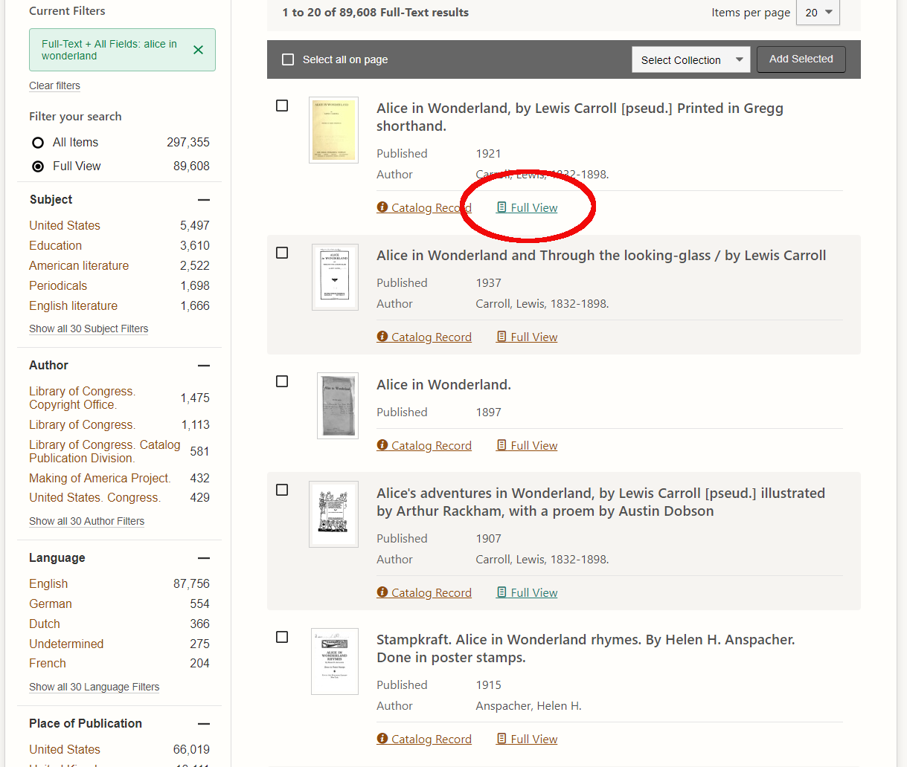
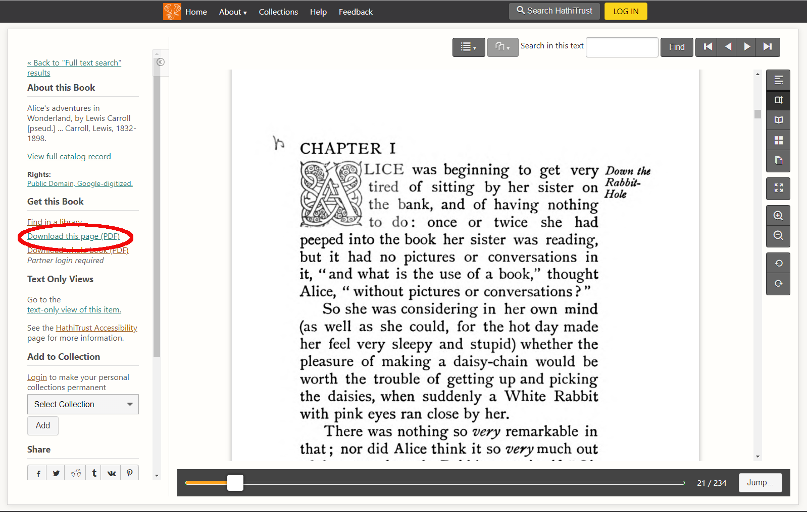

# Acrobat & the PDF Format

The rational and outline of the original PDF project are described by John Warnock in _The Camelot Paper_[^1]. The ubiquity of PDFs today makes it interesting to consider some of the problem statement from that paper:

> What industries badly need is a universal way to communicate documents across a wide variety of machine configurations, operating systems and communication networks. These documents should be viewable on any display and should be printable on any modern printers. If this problem can be solved, then the fundamental way people work will change (pp. 1).

>  Imagine being able to send full text and graphics documents (newspapers, magazine articles, technical manuals etc.) over electronic mail distribution networks. These documents could be viewed on any machine and any selected document could be printed locally. This capability would truly change the way information is managed (pp. 5). 

To be platform independent and protable, PDFs have always had to be self-contained. That is, a PDF file includes its own fonts and other dependencies necessary to view or print it. Since 2008, the PDF has been an open ISO standard, and Adobe has granted royalty-free rights to related technologies necessary to develop or market standard-compliant applications[^2]. Consider this in comparison with the MPEG _MPEG-1_ and _MPEG-2_ standards...

### Exploring the PDF Format

1. Go to the Hathi Trust Digital Library at <https://www.hathitrust.org/>. Do a search for a topic or title of interest. In this example, we searched for _Alice in Wonderland_[^3].
2. Select an item from the result list and click on its _Full View_ link:

3. Scroll to a page with some combination of text and other elements - images, multiple fonts, etc. Click the _Download this page (PDF)_ link to download just that page. (Note that page 1 of _Alice in Wonderland_ is included in the GitHub repository for this workshop).

4. Open the file in Acrobat DC. Examine the properties - what fonts are included?
5. From the _File-> Export To_ menu, select a text format (MS Word, Text or Rich Text Format) and export the page in that format. Open the exported file and compare with the PDF original. What's different? Note things like file size, layout and font(s) of text, presence or absence of text and/or images, etc. Note that exporting to plain text is essentially the same as exporting the OCR layer.
6. Repeat the export process to HTML format.
7. Repeat the export process to PostScript or Encapsulated PostScript format. Use a text editor to open this file and compare with the PDF. Note especially the filesize difference between the PDF and PS/EPS files. In the case of _Alice_, one page is over 11MB in PS/EPS format. The PDF image of the same page is around 220-225KB.

## Acrobat & the Creative Cloud IDE

Within the Creative Cloud launcher, Acrobat is included in two categories: _Design & Layout_, and _Acrobat & PDF_. It is possible to create a blank PDF and edit it to create forms and other types of documents, but typically PDFs are converted from scanned images or other files. Also, PDFs are often the final product of design or desktop publishing workflows in which content is created using other applications such as Illustrator. This makes PDFs useful for processes including:

* Gathering feedback and signatures
* Document processing (redactions, OCR, optimization and compression, etc.)

### Collaborative PDF Editing

1. Use Acrobat DC to open the file _menu.pdf_, included in the GitHub repository for this workshop.
2. In the _Tools_ menu, select "Comment." This will open a markup toolbar.
3. Take a few minutes to comment on and mark up the document.
4. Use the _Edit PDF_ toolbar to make other changes to the document - add background color, add text or images, etc.
5. Once you have made some edits and comments, click on the _Send for Review_ tool. Pick a collaborator to review the file and share it with them. You can also send it to yourself, including an external email account that will be granted guest access to the document.
6. Using either the Acrobat or the web UI, make additional comments and edits to the copy your collaborator shared for review.

Note that the Acrobat GUI tracks comments and edits. To finish the review process, open the file and click the _Done_ button in the review toolbar. Also note that Acrobat stores the comments and reviews in memory rather than in the original file. Edit the original file more to address the comments. Add an "approved" stamp and a signature to the final menu.

Other useful features include _Redact_, _Protect_, and _Optimize_.

### Using the Adobe Scan App

Install the Adobe Scan app to your mobile phone. It should be available from the app store for your platform, or alternatively from the Adobe Creative Cloud launcher. The app can be used to create fillable forms from scanned paper copies, add contact info from a business card straight to your "Contacts." 

[^1]: Warnock, John (1991). "The Camelot Project." Accessed 2019-12-12 from <https://planetpdf.com/planetpdf/pdfs/warnock_camelot.pdf>.

[^2]: For more information on the history of the PDF, see Wikipedia (2019). "PDF." Accessed 2019-12-12 from <https://en.wikipedia.org/wiki/PDF>, and Wikipedia (2019). "History of the Portable Document Format (PDF)." Accessed 2019-12-12 from <https://en.wikipedia.org/wiki/History_of_the_Portable_Document_Format_(PDF)>.

[^3]: Carroll, L., Dobson, A., Rackham, A. (1907). Alice's adventures in Wonderland. London: W. Heinemann.
